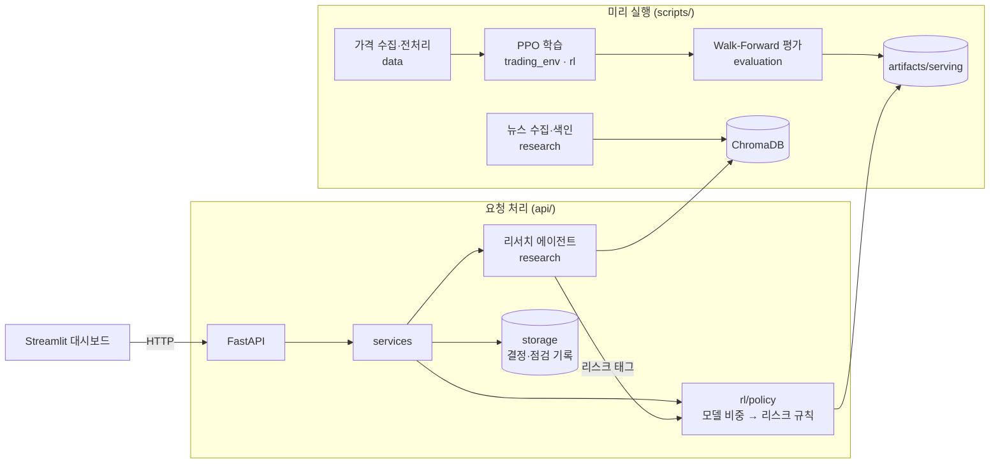

# 시스템 아키텍처

TODO: 제안 발표 전에 확정하고 README·리포트 1장에 넣는다.

- 무거운 계산(학습·백테스트·SHAP·ANOVA·임베딩)은 미리 실행하고, API는 결과를 읽거나 가벼운 추론만 한다 (요청당 5초).
- 대시보드는 API로만 통신한다.
- 백테스트와 서비스는 같은 `rl/policy.py`를 써서 같은 방식으로 비중을 정한다.
